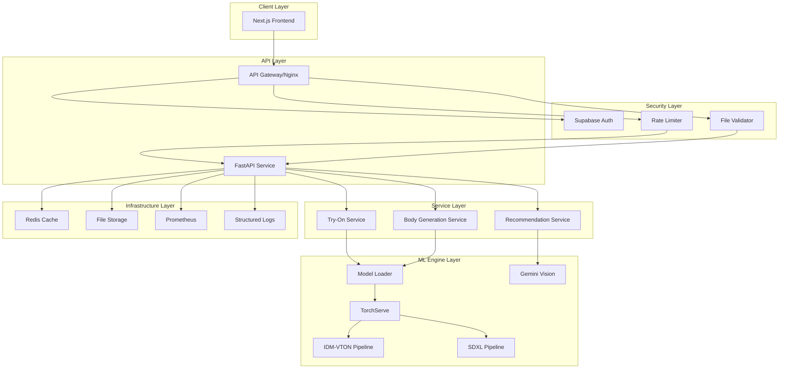

# Design Document: Codebase Modernization

## Overview

This design document outlines the technical architecture and implementation approach for modernizing the virtual try-on platform. The modernization transforms the existing Next.js 16 + FastAPI application into a production-ready system addressing critical security vulnerabilities, incomplete ML implementations, performance bottlenecks, and operational gaps.

The design follows a layered architecture approach with clear separation of concerns:
- **Security Layer**: Authentication, authorization, input validation, rate limiting
- **API Layer**: RESTful endpoints with versioning and comprehensive documentation
- **Service Layer**: Business logic, orchestration, and external integrations
- **ML Engine Layer**: Model serving, inference, caching, and lifecycle management
- **Infrastructure Layer**: Containerization, monitoring, logging, and deployment

Key design principles:
- **Security by default**: All endpoints protected, inputs validated, transport encrypted
- **Performance optimization**: Model preloading, quantization, async batching, caching
- **Graceful degradation**: Circuit breakers, fallbacks, clear error messaging
- **Observability**: Structured logging, metrics, health checks, distributed tracing
- **Maintainability**: Comprehensive testing, code quality standards, clear documentation

## Architecture

### High-Level System Architecture



### Security Architecture

The security architecture implements defense-in-depth with multiple layers:

1. **Transport Security**: HTTPS enforcement, HSTS headers, secure CORS
2. **Authentication**: Server-side session validation, httpOnly cookies, CSRF protection
3. **Authorization**: Role-based access control, resource ownership validation
4. **Input Validation**: Pydantic schemas, file validation, sanitization
5. **Rate Limiting**: Token bucket algorithm, per-user and per-IP limits
6. **Monitoring**: Security event logging, anomaly detection, alerting

### ML Model Serving Architecture

The ML serving architecture optimizes for performance and reliability:

1. **Model Loading**: Preload on startup, warmup with sample inputs
2. **Inference Serving**: TorchServe with worker management, async batching
3. **Optimization**: INT8 quantization, GPU memory management
4. **Caching**: Model cache with LRU eviction, result caching
5. **Monitoring**: Inference metrics, GPU utilization, cache hit rates

## Components and Interfaces

### 1. Authentication Service

**Purpose**: Manage user authentication and session validation

**Interface**:
```python
class AuthService:
    async def validate_session(self, token: str) -> Optional[User]:
        """Validate session token and return user if valid"""
        
    async def refresh_session(self, refresh_token: str) -> SessionTokens:
        """Refresh expired session tokens"""
        
    async def revoke_session(self, token: str) -> bool:
        """Revoke a session token"""
```

**Implementation Details**:
- Use Supabase Auth SDK for token validation
- Implement server-side session validation (no localStorage fallback)
- Store sessions in httpOnly cookies with secure, sameSite=strict flags
- Implement CSRF token validation for state-changing operations
- Log all authentication events with request metadata

**Dependencies**: Supabase Auth API, Redis for session cache

### 2. File Validator

**Purpose**: Validate uploaded files for security and compliance

**Interface**:
```python
class FileValidator:
    def __init__(self, max_size_mb: int = 10, allowed_types: Set[str] = {"image/jpeg", "image/png", "image/webp"}):
        self.max_size_mb = max_size_mb
        self.allowed_types = allowed_types
    
    async def validate_file(self, file: UploadFile) -> ValidationResult:
        """Validate file size, MIME type, and content"""
        
    def sanitize_filename(self, filename: str) -> str:
        """Sanitize filename to prevent path traversal"""
```

**Validation Steps**:
1. Check file size against limit (10MB default)
2. Validate declared MIME type against allowed types
3. Read file header to verify actual content type matches declared type
4. Sanitize filename (remove path separators, special characters)
5. Generate unique storage filename (UUID + sanitized extension)

**Error Handling**:
- Return HTTP 413 for oversized files
- Return HTTP 415 for unsupported media types
- Return HTTP 400 for invalid filenames
- Log validation failures with file metadata (size, type, source IP)

### 3. Rate Limiter

**Purpose**: Enforce request rate limits to prevent abuse

**Interface**:
```python
class RateLimiter:
    def __init__(self, redis_client: Redis):
        self.redis = redis_client
        self.limits = {
            "ml_inference": (10, 60),  # 10 requests per 60 seconds
            "read_only": (100, 60),     # 100 requests per 60 seconds
        }
    
    async def check_rate_limit(self, key: str, limit_type: str) -> RateLimitResult:
        """Check if request is within rate limit"""
        
    async def record_request(self, key: str, limit_type: str) -> None:
        """Record a request for rate limiting"""
```

**Implementation**:
- Use Redis for distributed rate limiting
- Implement token bucket algorithm for smooth rate limiting
- Track limits per authenticated user ID and per IP address
- Return HTTP 429 with Retry-After header when limit exceeded
- Expose rate limit headers (X-RateLimit-Limit, X-RateLimit-Remaining, X-RateLimit-Reset)

**Rate Limit Configuration**:
- ML inference endpoints: 10 requests/minute per user
- Read-only endpoints: 100 requests/minute per user
- Anonymous requests: 20 requests/minute per IP
- Burst allowance: 2x normal rate for short periods

### 4. Model Loader

**Purpose**: Load, cache, and manage ML models efficiently

**Interface**:
```python
class ModelLoader:
    _instance = None
    _lock = threading.Lock()
    
    @classmethod
    def get_instance(cls) -> 'ModelLoader':
        """Thread-safe singleton instance"""
        
    async def load_model(self, model_name: str, model_config: ModelConfig) -> torch.nn.Module:
        """Load model with caching"""
        
    async def preload_models(self) -> None:
        """Preload all models on startup"""
        
    async def warmup_model(self, model_name: str) -> None:
        """Warmup model with sample inputs"""
        
    def get_memory_usage(self) -> Dict[str, float]:
        """Get current GPU memory usage"""
        
    async def evict_lru_model(self) -> None:
        """Evict least recently used model"""
```

**Implementation Details**:
- Implement thread-safe singleton using class-level lock
- Cache loaded models in memory with LRU eviction policy
- Monitor GPU memory usage, evict models when >80% utilized
- Support model versioning with semantic versioning
- Implement model warmup with representative sample inputs
- Log model loading times, cache hit rates, memory usage

**Model Lifecycle**:
1. **Startup**: Preload critical models (IDM-VTON, SDXL)
2. **Runtime**: Load on-demand models with caching
3. **Memory Pressure**: Evict LRU models to free memory
4. **Shutdown**: Gracefully unload all models

### 5. IDM-VTON Service

**Purpose**: Perform virtual try-on using IDM-VTON model

**Interface**:
```python
class IDMVTONService:
    def __init__(self, model_loader: ModelLoader):
        self.model_loader = model_loader
        self.pipeline = None
    
    async def initialize(self) -> None:
        """Initialize IDM-VTON pipeline"""
        
    async def process_tryon(
        self,
        person_image: Image.Image,
        garment_image: Image.Image,
        options: TryOnOptions
    ) -> TryOnResult:
        """Process virtual try-on"""
        
    async def batch_process(
        self,
        requests: List[TryOnRequest]
    ) -> List[TryOnResult]:
        """Batch process multiple try-on requests"""
```

**Pipeline Steps**:
1. **Preprocessing**: Resize images to 512x768, normalize
2. **Segmentation**: Extract person segmentation mask
3. **Pose Estimation**: Detect pose keypoints
4. **Garment Transfer**: Apply IDM-VTON diffusion model
5. **Postprocessing**: Upscale result, apply refinements
6. **Caching**: Cache intermediate results (masks, poses) for reuse

**Performance Optimizations**:
- Use TorchServe for model serving with worker management
- Implement async batching (batch size: 4, max wait: 2 seconds)
- Apply INT8 quantization to non-critical layers
- Cache segmentation masks and pose keypoints
- Use xformers for memory-efficient attention

### 6. Recommendation Engine

**Purpose**: Generate AI-powered outfit recommendations

**Interface**:
```python
class RecommendationEngine:
    def __init__(self, gemini_client: GeminiClient, ebay_client: EbayClient):
        self.gemini = gemini_client
        self.ebay = ebay_client
        self.cache = TTLCache(maxsize=1000, ttl=3600)
    
    async def get_recommendations(
        self,
        user_photo: Image.Image,
        wardrobe_images: Optional[List[Image.Image]],
        generated_images: Optional[List[Image.Image]]
    ) -> List[ProductRecommendation]:
        """Get outfit recommendations"""
        
    async def create_collage(self, images: List[Image.Image]) -> Image.Image:
        """Create image collage for analysis"""
        
    async def extract_keywords(self, collage: Image.Image) -> List[str]:
        """Extract fashion keywords using Gemini Vision"""
        
    async def search_products(self, keywords: List[str]) -> List[Product]:
        """Search eBay for products"""
```

**Implementation Flow**:
1. **Collage Creation**: Combine user photo, wardrobe, generated images into grid
2. **Style Analysis**: Send collage to Gemini Vision API with prompt:
   - "Analyze this fashion collage and extract style keywords"
   - "Consider color theory, body type, current trends"
   - "Return 5-10 specific keywords for product search"
3. **Product Search**: Query eBay API with extracted keywords
4. **Ranking**: Rank products by relevance, price, ratings
5. **Caching**: Cache recommendations for 1 hour per user

**Error Handling**:
- Implement circuit breaker for Gemini API (open after 5 failures)
- Fall back to cached recommendations if APIs unavailable
- Return graceful error messages without exposing API details
- Log API failures with request IDs for debugging

### 7. Health Monitor

**Purpose**: Monitor system health and dependencies

**Interface**:
```python
class HealthMonitor:
    async def check_health(self) -> HealthStatus:
        """Comprehensive health check"""
        
    async def check_gpu(self) -> ComponentHealth:
        """Check GPU availability and memory"""
        
    async def check_models(self) -> ComponentHealth:
        """Check model loading status"""
        
    async def check_external_apis(self) -> ComponentHealth:
        """Check external API connectivity"""
        
    async def get_metrics(self) -> Dict[str, float]:
        """Get Prometheus metrics"""
```

**Health Checks**:
1. **GPU Health**: Check CUDA availability, memory usage, temperature
2. **Model Health**: Verify models loaded, warmup completed
3. **API Health**: Ping Gemini, eBay, Supabase APIs
4. **Storage Health**: Check disk space, write permissions
5. **Cache Health**: Verify Redis connectivity

**Health Status Levels**:
- **Healthy**: All checks passing
- **Degraded**: Non-critical checks failing (e.g., recommendations unavailable)
- **Unhealthy**: Critical checks failing (e.g., GPU unavailable, models not loaded)

**Metrics Exposed**:
- Request count, latency, error rate per endpoint
- Model inference time, batch size, throughput
- GPU memory usage, utilization percentage
- Cache hit rate, eviction count
- Rate limit violations per user/IP

## Data Models

### Request/Response Schemas

```python
from pydantic import BaseModel, Field, validator
from typing import Optional, List
from enum import Enum

class BodyType(str, Enum):
    SLIM = "slim"
    ATHLETIC = "athletic"
    AVERAGE = "average"
    CURVY = "curvy"
    PLUS_SIZE = "plus_size"

class Ethnicity(str, Enum):
    ASIAN = "asian"
    BLACK = "black"
    HISPANIC = "hispanic"
    WHITE = "white"
    MIDDLE_EASTERN = "middle_eastern"
    MIXED = "mixed"

class TryOnRequest(BaseModel):
    user_image: bytes
    garment_image: bytes
    options: Optional[Dict[str, Any]] = Field(default_factory=dict)
    
    @validator('user_image', 'garment_image')
    def validate_image_size(cls, v):
        if len(v) > 10 * 1024 * 1024:  # 10MB
            raise ValueError("Image size exceeds 10MB limit")
        return v

class TryOnResponse(BaseModel):
    result_url: str
    processing_time: float
    cached: bool = False
    metadata: Dict[str, Any] = Field(default_factory=dict)

class BodyGenerationRequest(BaseModel):
    ethnicity: Ethnicity
    body_type: BodyType
    height_cm: float = Field(ge=140, le=220)
    weight_kg: float = Field(ge=40, le=200)
    skin_tone: str
    count: int = Field(default=4, ge=1, le=10)
    
    @validator('height_cm')
    def validate_height(cls, v):
        if not 140 <= v <= 220:
            raise ValueError("Height must be between 140-220 cm")
        return v
    
    @validator('weight_kg')
    def validate_weight(cls, v):
        if not 40 <= v <= 200:
            raise ValueError("Weight must be between 40-200 kg")
        return v

class RecommendationRequest(BaseModel):
    user_photo: bytes
    wardrobe_images: Optional[List[bytes]] = None
    generated_images: Optional[List[bytes]] = None
    max_results: int = Field(default=10, ge=1, le=50)

class ProductRecommendation(BaseModel):
    id: str
    name: str
    image_url: str
    price: float
    currency: str = "USD"
    category: str
    ebay_url: str
    relevance_score: float

class HealthStatus(BaseModel):
    status: str  # "healthy", "degraded", "unhealthy"
    checks: Dict[str, ComponentHealth]
    timestamp: str

class ComponentHealth(BaseModel):
    status: str
    message: Optional[str] = None
    details: Optional[Dict[str, Any]] = None

class ErrorResponse(BaseModel):
    error_code: str
    message: str
    details: Optional[Dict[str, Any]] = None
    request_id: str
```

### Configuration Models

```python
class ModelConfig(BaseModel):
    name: str
    version: str
    path: str
    device: str = "cuda"
    quantization: Optional[str] = None  # "int8", "fp16", None
    batch_size: int = 1
    max_batch_wait_ms: int = 2000

class RateLimitConfig(BaseModel):
    endpoint_pattern: str
    requests_per_minute: int
    burst_multiplier: float = 2.0
    per_user: bool = True
    per_ip: bool = True

class SecurityConfig(BaseModel):
    enforce_https: bool = True
    allowed_origins: List[str]
    max_file_size_mb: int = 10
    allowed_mime_types: Set[str] = {"image/jpeg", "image/png", "image/webp"}
    session_timeout_minutes: int = 60
    csrf_enabled: bool = True

class AppConfig(BaseModel):
    environment: str  # "development", "staging", "production"
    log_level: str = "INFO"
    security: SecurityConfig
    rate_limits: List[RateLimitConfig]
    models: List[ModelConfig]
    
    @validator('environment')
    def validate_environment(cls, v):
        if v not in ["development", "staging", "production"]:
            raise ValueError("Invalid environment")
        return v
    
    @validator('security')
    def validate_security_production(cls, v, values):
        if values.get('environment') == 'production':
            if not v.enforce_https:
                raise ValueError("HTTPS must be enforced in production")
            if "*" in v.allowed_origins:
                raise ValueError("Wildcard CORS not allowed in production")
        return v
```

## Correctness Properties

*A property is a characteristic or behavior that should hold true across all valid executions of a system—essentially, a formal statement about what the system should do. Properties serve as the bridge between human-readable specifications and machine-verifiable correctness guarantees.*

Before defining the correctness properties, I'll analyze each acceptance criterion from the requirements to determine testability.


### Property Reflection

After analyzing all acceptance criteria, I've identified the following redundancies and consolidations:

**Authentication Properties (1.1, 1.2)**: Can be combined into a single comprehensive property about session validation behavior.

**File Validation Properties (2.1, 2.2, 2.3)**: These test different aspects of file validation but are complementary, not redundant. Keep separate.

**Rate Limiting Properties (3.3, 3.4)**: Both test endpoint-specific limits. Can be combined into one property about per-endpoint rate limit configuration.

**Input Validation Properties (10.1, 10.2)**: 10.1 tests validation occurs, 10.2 tests error format. These are complementary, keep separate.

**Caching Properties (5.6, 16.3)**: Both test caching but at different layers (ML intermediate results vs HTTP responses). Keep separate.

**Error Logging Properties (11.1, 11.2)**: 11.1 tests log format, 11.2 tests error-specific logging. Complementary, keep separate.

**Health Check Properties (13.1, 13.2, 13.3)**: All test different aspects of health monitoring. Keep separate for granular validation.

After reflection, the properties below represent the minimal set needed for comprehensive validation without redundancy.

### Correctness Properties

Property 1: Session Validation Consistency
*For any* session token, the authentication service should either grant access (if valid) or reject with redirect (if invalid/expired), never falling back to localStorage.
**Validates: Requirements 1.1, 1.2**

Property 2: CSRF Protection Universality
*For any* state-changing HTTP request (POST, PUT, DELETE, PATCH), the system should require and validate a CSRF token.
**Validates: Requirements 1.3**

Property 3: Authentication Failure Logging
*For any* failed authentication attempt, the system should log the event with request metadata (IP, timestamp, user agent, reason).
**Validates: Requirements 1.5**

Property 4: File Size Enforcement
*For any* uploaded file, if the file size exceeds 10MB, the system should reject it with HTTP 413 before processing.
**Validates: Requirements 2.1**

Property 5: MIME Type Validation
*For any* uploaded file, if the declared MIME type is not in the allowed set (image/jpeg, image/png, image/webp), the system should reject it with HTTP 415.
**Validates: Requirements 2.2**

Property 6: Content Type Verification
*For any* uploaded file, if the file content (magic number) doesn't match the declared MIME type, the system should reject it with HTTP 400.
**Validates: Requirements 2.3**

Property 7: Filename Sanitization
*For any* uploaded filename containing path traversal sequences (../, ..\, absolute paths), the system should sanitize them to prevent directory traversal.
**Validates: Requirements 2.4**

Property 8: Error Message Safety
*For any* file validation failure, the error message should not contain internal file paths or system information.
**Validates: Requirements 2.5**

Property 9: Token Bucket Rate Limiting
*For any* sequence of requests from a user, the rate limiter should allow bursts up to 2x the normal rate, then throttle to the configured rate.
**Validates: Requirements 3.1**

Property 10: Rate Limit Response Format
*For any* request that exceeds rate limits, the system should return HTTP 429 with Retry-After header indicating when to retry.
**Validates: Requirements 3.2**

Property 11: Per-Endpoint Rate Limits
*For any* endpoint, the rate limiter should enforce the configured limit for that endpoint type (10/min for ML, 100/min for read-only).
**Validates: Requirements 3.3, 3.4**

Property 12: Rate Limit Isolation
*For any* two different users or IP addresses, their rate limits should be tracked independently (one user hitting limits doesn't affect another).
**Validates: Requirements 3.5**

Property 13: Rate Limit Violation Logging
*For any* rate limit violation, the system should log the event with user/IP, endpoint, and timestamp.
**Validates: Requirements 3.6**

Property 14: Try-On Pipeline Completeness
*For any* valid try-on request, the system should execute all pipeline steps (segmentation, pose estimation, garment transfer) and return a result.
**Validates: Requirements 5.2**

Property 15: Try-On Output Resolution
*For any* completed try-on result, the output image dimensions should be at least 512x768 pixels.
**Validates: Requirements 5.3**

Property 16: Batch Processing Completeness
*For any* batch of try-on requests, all requests in the batch should be processed and return results.
**Validates: Requirements 5.4**

Property 17: Intermediate Result Caching
*For any* image processed twice, the second processing should reuse cached intermediate results (segmentation, pose) and complete faster.
**Validates: Requirements 5.6**

Property 18: Collage Creation Consistency
*For any* set of images (user photo + wardrobe + generated), the system should create a collage containing all provided images.
**Validates: Requirements 6.2**

Property 19: Keyword Extraction
*For any* valid image collage, the Gemini Vision API should return a non-empty list of fashion keywords.
**Validates: Requirements 6.3**

Property 20: Product Search Integration
*For any* non-empty list of keywords, the eBay API should return a list of product recommendations.
**Validates: Requirements 6.4**

Property 21: API Failure Fallback
*For any* external API failure (Gemini, eBay), the system should either return cached results or a graceful error message, never exposing internal errors.
**Validates: Requirements 6.5**

Property 22: Quantization Accuracy Preservation
*For any* model with INT8 quantization, the accuracy difference compared to full-precision should be less than 2%.
**Validates: Requirements 7.4**

Property 23: Async Batch Formation
*For any* set of concurrent inference requests arriving within the batch window (2 seconds), they should be batched together for processing.
**Validates: Requirements 7.5**

Property 24: GPU Memory Cleanup
*For any* inference operation, GPU memory should be released after completion, preventing memory leaks.
**Validates: Requirements 7.6**

Property 25: Singleton Thread Safety
*For any* number of concurrent threads attempting to get the ModelLoader instance, only one instance should be created.
**Validates: Requirements 8.1**

Property 26: LRU Cache Eviction
*For any* model cache at capacity, loading a new model should evict the least-recently-used model.
**Validates: Requirements 8.2**

Property 27: Pydantic Validation Enforcement
*For any* API request with invalid parameters, the system should return HTTP 422 with field-level validation errors.
**Validates: Requirements 10.1, 10.2**

Property 28: XSS Sanitization
*For any* user-provided string containing HTML/JavaScript, the system should sanitize it to prevent XSS execution.
**Validates: Requirements 10.3**

Property 29: Numeric Range Validation
*For any* body parameter request, height values outside 140-220cm or weight values outside 40-200kg should be rejected.
**Validates: Requirements 10.4**

Property 30: Enum Validation
*For any* categorical parameter (ethnicity, body_type), values not in the defined enum should be rejected.
**Validates: Requirements 10.5**

Property 31: Strict Schema Validation
*For any* API request containing fields not defined in the schema, the system should reject the request.
**Validates: Requirements 10.6**

Property 32: Structured Log Format
*For any* log entry, it should be valid JSON containing at minimum: timestamp, level, message, and request_id.
**Validates: Requirements 11.1**

Property 33: Error Stack Trace Logging
*For any* exception, the system should log the full stack trace with contextual information (request_id, user_id, endpoint).
**Validates: Requirements 11.2**

Property 34: Consistent Error Response Format
*For any* error response, it should follow the ErrorResponse schema with error_code, message, and request_id.
**Validates: Requirements 11.4**

Property 35: Request ID Propagation
*For any* request, the same request_id should appear in all log entries related to that request across all services.
**Validates: Requirements 11.5**

Property 36: Inference Metrics Logging
*For any* ML inference operation, the system should log performance metrics (duration, model_name, batch_size, GPU_memory).
**Validates: Requirements 11.6**

Property 37: Configuration Type Validation
*For any* configuration value, if the type doesn't match the schema (e.g., string instead of int), the system should fail validation at startup.
**Validates: Requirements 15.3**

Property 38: Sensitive Value Masking
*For any* log entry or error message containing API keys or passwords, those values should be masked (e.g., "sk_***...***").
**Validates: Requirements 15.5**

Property 39: Health Check Performance
*For any* health check request, the response time should be less than 100ms.
**Validates: Requirements 16.1**

Property 40: Try-On Performance
*For any* try-on request at standard resolution (512x768), the processing time should be less than 10 seconds.
**Validates: Requirements 16.2**

Property 41: Response Caching
*For any* identical request made twice within 1 hour, the second request should return cached results and complete faster.
**Validates: Requirements 16.3**

Property 42: Response Compression
*For any* API response larger than 1KB, the response should be compressed with gzip encoding.
**Validates: Requirements 16.6**

Property 43: API Timeout Fallback
*For any* external API call that times out, the system should return cached results if available, otherwise a graceful error.
**Validates: Requirements 20.3**

Property 44: Circuit Breaker State Transitions
*For any* external service, after N consecutive failures (N=5), the circuit breaker should open and reject requests without calling the service.
**Validates: Requirements 20.5**

## Error Handling

### Error Categories and Codes

The system implements a hierarchical error code system for consistent error handling:

```python
class ErrorCode(str, Enum):
    # Authentication Errors (1xxx)
    AUTH_INVALID_TOKEN = "AUTH_1001"
    AUTH_EXPIRED_TOKEN = "AUTH_1002"
    AUTH_MISSING_TOKEN = "AUTH_1003"
    AUTH_INSUFFICIENT_PERMISSIONS = "AUTH_1004"
    
    # Validation Errors (2xxx)
    VALIDATION_INVALID_INPUT = "VAL_2001"
    VALIDATION_FILE_TOO_LARGE = "VAL_2002"
    VALIDATION_INVALID_MIME_TYPE = "VAL_2003"
    VALIDATION_CONTENT_MISMATCH = "VAL_2004"
    VALIDATION_INVALID_FILENAME = "VAL_2005"
    
    # Rate Limiting Errors (3xxx)
    RATE_LIMIT_EXCEEDED = "RATE_3001"
    
    # ML Service Errors (4xxx)
    ML_MODEL_NOT_LOADED = "ML_4001"
    ML_INFERENCE_FAILED = "ML_4002"
    ML_GPU_OUT_OF_MEMORY = "ML_4003"
    ML_INVALID_INPUT_DIMENSIONS = "ML_4004"
    
    # External Service Errors (5xxx)
    EXT_GEMINI_UNAVAILABLE = "EXT_5001"
    EXT_EBAY_UNAVAILABLE = "EXT_5002"
    EXT_SUPABASE_UNAVAILABLE = "EXT_5003"
    EXT_SERVICE_TIMEOUT = "EXT_5004"
    
    # System Errors (9xxx)
    SYS_INTERNAL_ERROR = "SYS_9001"
    SYS_CONFIGURATION_ERROR = "SYS_9002"
    SYS_STORAGE_ERROR = "SYS_9003"
```

### Error Response Format

All errors follow a consistent response format:

```python
{
    "error_code": "VAL_2002",
    "message": "File size exceeds maximum allowed size of 10MB",
    "details": {
        "file_size_mb": 15.3,
        "max_size_mb": 10,
        "field": "user_image"
    },
    "request_id": "req_abc123xyz"
}
```

### Error Handling Strategies

**1. Input Validation Errors**:
- Return HTTP 422 with field-level details
- Log validation failures at INFO level
- Include helpful error messages for client correction

**2. Authentication/Authorization Errors**:
- Return HTTP 401 for authentication failures
- Return HTTP 403 for authorization failures
- Log at WARNING level with request metadata
- Clear client-side session state on token expiration

**3. Rate Limiting Errors**:
- Return HTTP 429 with Retry-After header
- Log at INFO level (expected behavior)
- Include rate limit headers in response

**4. ML Service Errors**:
- Return HTTP 503 for model unavailability
- Return HTTP 500 for inference failures
- Log at ERROR level with full context
- Implement retry logic with exponential backoff

**5. External Service Errors**:
- Implement circuit breaker pattern
- Fall back to cached results when available
- Return HTTP 503 with degraded service message
- Log at WARNING level with service name and error

**6. System Errors**:
- Return HTTP 500 with generic message
- Log at ERROR level with full stack trace
- Mask sensitive information in error responses
- Trigger alerts for critical errors

### Graceful Degradation

The system implements graceful degradation for non-critical services:

```python
class ServiceStatus(str, Enum):
    HEALTHY = "healthy"
    DEGRADED = "degraded"
    UNHEALTHY = "unhealthy"

# Example: Recommendations service degradation
if gemini_circuit_breaker.is_open():
    # Disable recommendations, return cached results
    return {
        "status": ServiceStatus.DEGRADED,
        "message": "AI recommendations temporarily unavailable",
        "recommendations": get_cached_recommendations(user_id),
        "degraded_services": ["gemini_vision"]
    }
```

## Testing Strategy

### Testing Approach

The modernization implements a comprehensive testing strategy with three complementary layers:

1. **Unit Tests**: Test individual functions and classes in isolation
2. **Property-Based Tests**: Validate universal properties across generated inputs
3. **Integration Tests**: Test API endpoints with mocked external dependencies
4. **End-to-End Tests**: Validate critical user flows with real services

### Unit Testing

**Coverage Target**: Minimum 80% code coverage for backend services

**Focus Areas**:
- Service layer business logic
- Data validation and transformation
- Error handling and edge cases
- Utility functions and helpers

**Example Unit Tests**:
```python
def test_file_validator_rejects_oversized_files():
    validator = FileValidator(max_size_mb=10)
    large_file = create_mock_file(size_mb=15)
    
    result = validator.validate_file(large_file)
    
    assert result.is_valid == False
    assert result.error_code == "VAL_2002"

def test_filename_sanitization_removes_path_traversal():
    validator = FileValidator()
    malicious_filename = "../../../etc/passwd"
    
    sanitized = validator.sanitize_filename(malicious_filename)
    
    assert ".." not in sanitized
    assert "/" not in sanitized
    assert "\\" not in sanitized
```

### Property-Based Testing

**Library**: Hypothesis (Python), fast-check (TypeScript)

**Configuration**: Minimum 100 iterations per property test

**Focus Areas**:
- Input validation across all possible inputs
- Data transformation invariants
- Caching and idempotency properties
- Error handling consistency

**Example Property Tests**:
```python
from hypothesis import given, strategies as st

@given(st.integers(min_value=0, max_value=1000))
def test_property_file_size_validation(size_mb: int):
    """
    Feature: codebase-modernization, Property 4: File Size Enforcement
    For any uploaded file, if size exceeds 10MB, system should reject it
    """
    validator = FileValidator(max_size_mb=10)
    file = create_mock_file(size_mb=size_mb)
    
    result = validator.validate_file(file)
    
    if size_mb > 10:
        assert result.is_valid == False
        assert result.error_code == "VAL_2002"
    else:
        # Size check passes (other validations may still fail)
        assert result.error_code != "VAL_2002"

@given(st.text(min_size=1, max_size=100))
def test_property_filename_sanitization(filename: str):
    """
    Feature: codebase-modernization, Property 7: Filename Sanitization
    For any filename, sanitization should remove path traversal sequences
    """
    validator = FileValidator()
    
    sanitized = validator.sanitize_filename(filename)
    
    # Invariant: sanitized filename never contains path separators
    assert ".." not in sanitized
    assert "/" not in sanitized
    assert "\\" not in sanitized
    # Invariant: sanitized filename is not empty
    assert len(sanitized) > 0

@given(st.lists(st.integers(min_value=1, max_value=100), min_size=1, max_size=20))
def test_property_rate_limit_isolation(request_counts: List[int]):
    """
    Feature: codebase-modernization, Property 12: Rate Limit Isolation
    For any two different users, their rate limits should be tracked independently
    """
    rate_limiter = RateLimiter(redis_client)
    user1_id = "user_1"
    user2_id = "user_2"
    
    # User 1 makes requests
    for _ in range(request_counts[0]):
        rate_limiter.record_request(user1_id, "ml_inference")
    
    # User 2's limit should be independent
    result = rate_limiter.check_rate_limit(user2_id, "ml_inference")
    
    assert result.is_allowed == True  # User 2 not affected by user 1's usage

@given(st.lists(st.binary(min_size=100, max_size=1000), min_size=2, max_size=10))
def test_property_collage_creation_consistency(images: List[bytes]):
    """
    Feature: codebase-modernization, Property 18: Collage Creation Consistency
    For any set of images, the system should create a collage containing all provided images
    """
    service = RecommendationEngine(gemini_client, ebay_client)
    pil_images = [Image.open(io.BytesIO(img)) for img in images]
    
    collage = service.create_collage(pil_images)
    
    # Invariant: collage dimensions accommodate all images
    assert collage.width >= max(img.width for img in pil_images)
    assert collage.height >= sum(img.height for img in pil_images)
    # Invariant: collage is not empty
    assert collage.size[0] > 0 and collage.size[1] > 0
```

### Integration Testing

**Focus Areas**:
- API endpoint request/response validation
- Authentication and authorization flows
- Rate limiting enforcement
- Error response formats

**Mocking Strategy**:
- Mock ML models with fast dummy implementations
- Mock external APIs (Gemini, eBay, Supabase)
- Use in-memory Redis for rate limiting tests
- Use temporary file storage for upload tests

**Example Integration Tests**:
```python
@pytest.mark.asyncio
async def test_tryon_endpoint_requires_authentication(client: TestClient):
    """Test that try-on endpoint rejects unauthenticated requests"""
    response = await client.post(
        "/api/v1/process-tryon",
        files={
            "user_image": ("user.jpg", create_test_image(), "image/jpeg"),
            "garment_image": ("garment.jpg", create_test_image(), "image/jpeg")
        }
    )
    
    assert response.status_code == 401
    assert response.json()["error_code"] == "AUTH_1003"

@pytest.mark.asyncio
async def test_file_upload_enforces_size_limit(client: TestClient, auth_token: str):
    """Test that oversized files are rejected"""
    large_file = create_test_image(size_mb=15)
    
    response = await client.post(
        "/api/v1/process-tryon",
        headers={"Authorization": f"Bearer {auth_token}"},
        files={
            "user_image": ("user.jpg", large_file, "image/jpeg"),
            "garment_image": ("garment.jpg", create_test_image(), "image/jpeg")
        }
    )
    
    assert response.status_code == 413
    assert response.json()["error_code"] == "VAL_2002"

@pytest.mark.asyncio
async def test_rate_limiting_returns_429(client: TestClient, auth_token: str):
    """Test that rate limiting is enforced"""
    # Make requests up to limit
    for _ in range(10):
        await client.post(
            "/api/v1/process-tryon",
            headers={"Authorization": f"Bearer {auth_token}"},
            files={
                "user_image": ("user.jpg", create_test_image(), "image/jpeg"),
                "garment_image": ("garment.jpg", create_test_image(), "image/jpeg")
            }
        )
    
    # Next request should be rate limited
    response = await client.post(
        "/api/v1/process-tryon",
        headers={"Authorization": f"Bearer {auth_token}"},
        files={
            "user_image": ("user.jpg", create_test_image(), "image/jpeg"),
            "garment_image": ("garment.jpg", create_test_image(), "image/jpeg")
        }
    )
    
    assert response.status_code == 429
    assert "Retry-After" in response.headers
```

### End-to-End Testing

**Focus Areas**:
- Complete user authentication flow
- Virtual try-on with real ML models
- Recommendation generation with external APIs
- Error recovery and graceful degradation

**Test Environment**:
- Use staging environment with real services
- Use test accounts and test data
- Monitor performance and resource usage
- Validate against production-like load

**Example E2E Tests**:
```python
@pytest.mark.e2e
@pytest.mark.slow
async def test_complete_tryon_flow():
    """Test complete virtual try-on flow from authentication to result"""
    # 1. Authenticate user
    auth_response = await authenticate_test_user()
    assert auth_response.status_code == 200
    token = auth_response.json()["access_token"]
    
    # 2. Upload user image
    user_image = load_test_image("test_user.jpg")
    garment_image = load_test_image("test_garment.jpg")
    
    # 3. Process try-on
    tryon_response = await client.post(
        "/api/v1/process-tryon",
        headers={"Authorization": f"Bearer {token}"},
        files={
            "user_image": ("user.jpg", user_image, "image/jpeg"),
            "garment_image": ("garment.jpg", garment_image, "image/jpeg")
        }
    )
    
    assert tryon_response.status_code == 200
    result = tryon_response.json()
    
    # 4. Validate result
    assert "result_url" in result
    assert result["processing_time"] < 10.0  # Performance requirement
    
    # 5. Verify result image exists and is valid
    result_image = await fetch_result_image(result["result_url"])
    assert result_image.width >= 512
    assert result_image.height >= 768
```

### Test Execution

**Local Development**:
```bash
# Run unit tests
pytest tests/unit -v

# Run property tests
pytest tests/property -v --hypothesis-show-statistics

# Run integration tests
pytest tests/integration -v

# Run with coverage
pytest --cov=app --cov-report=html
```

**CI/CD Pipeline**:
1. **Pre-commit**: Run linting and type checking
2. **Unit Tests**: Run on every commit (fast feedback)
3. **Property Tests**: Run on every commit (100 iterations)
4. **Integration Tests**: Run on every PR
5. **E2E Tests**: Run on staging deployment
6. **Coverage Check**: Fail if coverage < 80%

### Performance Testing

**Load Testing**:
- Use Locust or k6 for load testing
- Simulate realistic user patterns
- Test rate limiting under load
- Monitor GPU memory and utilization

**Benchmark Tests**:
```python
@pytest.mark.benchmark
def test_health_check_performance(benchmark):
    """Benchmark health check response time"""
    result = benchmark(lambda: client.get("/health"))
    
    assert result.status_code == 200
    assert benchmark.stats.mean < 0.1  # < 100ms

@pytest.mark.benchmark
def test_tryon_inference_performance(benchmark):
    """Benchmark try-on inference time"""
    user_img = create_test_image(512, 768)
    garment_img = create_test_image(512, 768)
    
    result = benchmark(
        lambda: process_tryon(user_img, garment_img)
    )
    
    assert benchmark.stats.mean < 10.0  # < 10 seconds
```

## Implementation Notes

### Technology Stack Updates

**Backend Dependencies** (additions to requirements.txt):
```
# Rate Limiting
slowapi==0.1.9
redis==5.0.1

# Testing
pytest==7.4.3
pytest-asyncio==0.21.1
pytest-cov==4.1.0
hypothesis==6.92.1
locust==2.20.0

# Security
python-magic==0.4.27  # MIME type detection
bleach==6.1.0  # XSS sanitization

# Monitoring
prometheus-client==0.19.0
opentelemetry-api==1.21.0
opentelemetry-sdk==1.21.0

# Model Serving
torchserve==0.9.0
torch-model-archiver==0.9.0

# Code Quality
ruff==0.1.8
black==23.12.1
mypy==1.7.1
```

**Frontend Dependencies** (additions to package.json):
```json
{
  "dependencies": {
    "@supabase/ssr": "^0.0.10"
  },
  "devDependencies": {
    "@testing-library/react": "^14.1.2",
    "@testing-library/jest-dom": "^6.1.5",
    "vitest": "^1.0.4",
    "fast-check": "^3.15.0"
  }
}
```

### Migration Strategy

The modernization will be implemented in phases to minimize disruption:

**Phase 1: Security Hardening** (Week 1-2)
- Implement authentication fixes
- Add file upload validation
- Add rate limiting
- Deploy to staging for testing

**Phase 2: ML Pipeline Completion** (Week 3-4)
- Integrate IDM-VTON model
- Complete recommendation engine
- Implement model serving optimizations
- Deploy to staging for testing

**Phase 3: Performance Optimization** (Week 5-6)
- Implement model preloading and caching
- Add quantization
- Implement async batching
- Performance testing and tuning

**Phase 4: Testing and Quality** (Week 7-8)
- Write comprehensive test suite
- Achieve 80% code coverage
- Set up CI/CD pipeline
- Code quality enforcement

**Phase 5: DevOps and Monitoring** (Week 9-10)
- Update Docker configuration
- Implement health checks and metrics
- Set up monitoring and alerting
- Production deployment

### Deployment Considerations

**Environment Configuration**:
- Use environment-specific .env files
- Validate configuration at startup
- Fail fast on misconfiguration
- Document all environment variables

**Database Migrations**:
- No database schema changes required
- Existing Supabase schema remains unchanged

**Backward Compatibility**:
- Maintain /api/v1 endpoints
- No breaking changes to existing API contracts
- Add new endpoints for new features

**Rollback Plan**:
- Keep previous Docker images tagged
- Implement feature flags for new functionality
- Monitor error rates and performance metrics
- Automated rollback on critical errors

### Security Considerations

**Secrets Management**:
- Store secrets in environment variables
- Never commit secrets to version control
- Rotate API keys quarterly
- Use different keys for dev/staging/production

**Network Security**:
- Enforce HTTPS in production
- Configure firewall rules
- Restrict database access
- Use VPC for service communication

**Audit Logging**:
- Log all authentication events
- Log all file uploads
- Log all rate limit violations
- Retain logs for 90 days

### Monitoring and Alerting

**Key Metrics**:
- Request rate and latency per endpoint
- Error rate by error code
- GPU utilization and memory
- Model inference time
- Cache hit rates
- Rate limit violations

**Alerts**:
- Error rate > 5% for 5 minutes
- GPU memory > 90% for 5 minutes
- Health check failures
- External API circuit breaker opens
- Rate limit violations > 100/minute

**Dashboards**:
- System health overview
- API performance metrics
- ML model performance
- Security events
- Resource utilization
